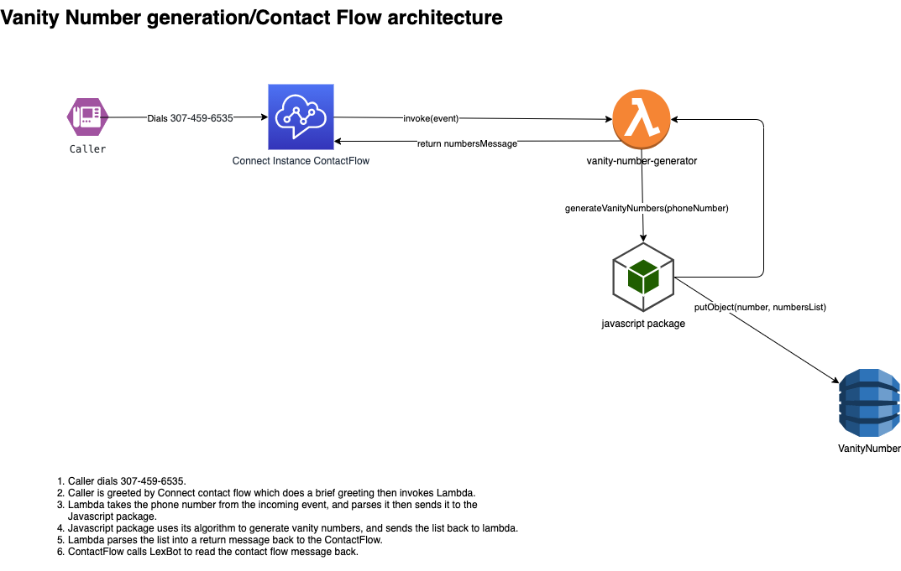

# vanity-numbers-connect

# About
This project generates a vanity number (easy to remember) number for your phone number when you call into an connected Amazon Connect instance.

This solution works and can take an incoming call at 307-459-6535.

## Code
For all the information about the code of this project, please see `src/README.md`.

## Deployment
For all the information about deploying this project, please see `deployment/README.md`.

## Design notes and "gotchas"
For my design notes, things that were a "gotcha", and other things asked for in this exercise, please see `NOTES.md`.

## Architecture
The AWS architecture diagram, created using (https://app.diagrams.net/), is below as a PNG. This can also be loaded into the diagrams.net tool using the `architecture.drawio` file contained in the root directory of the project.

